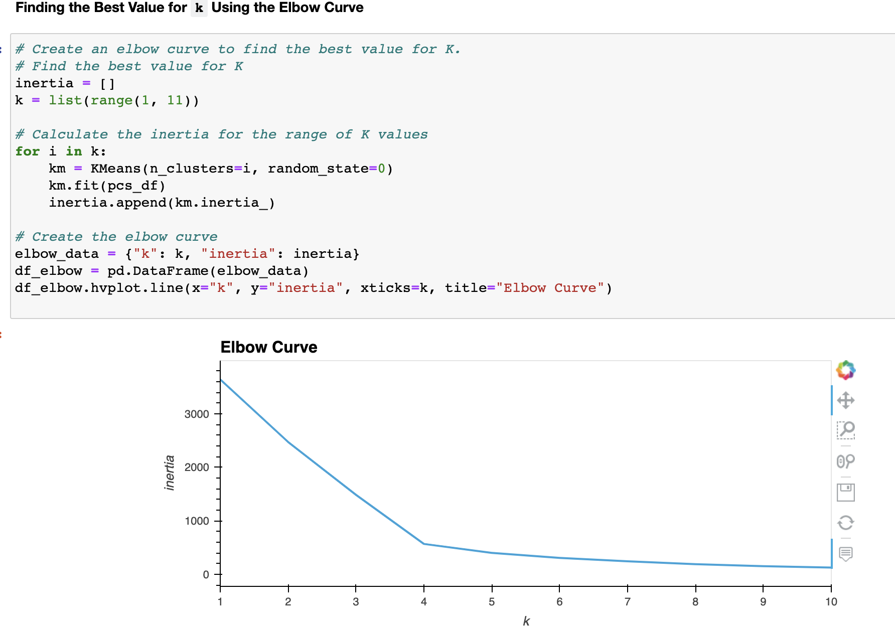
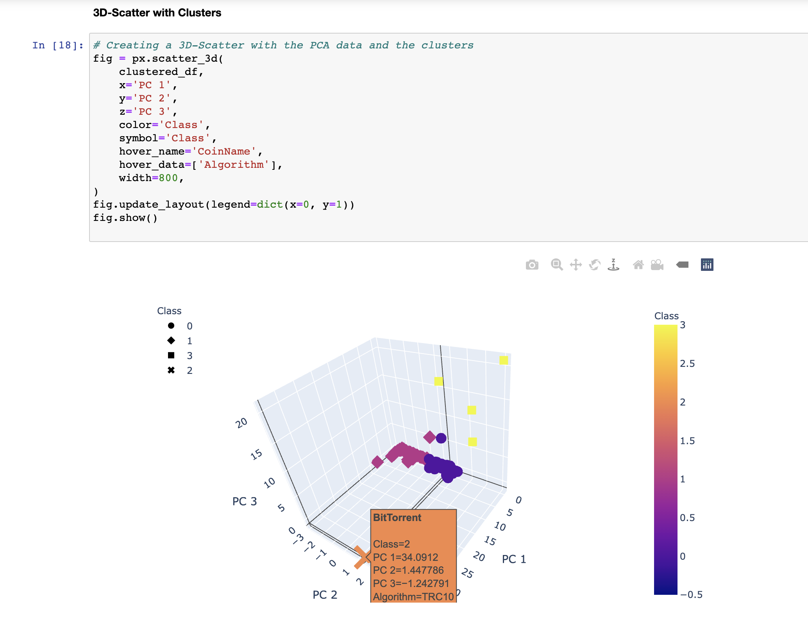
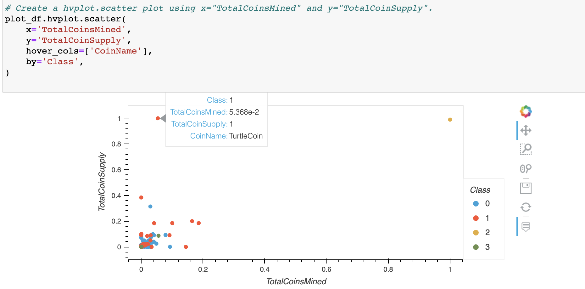
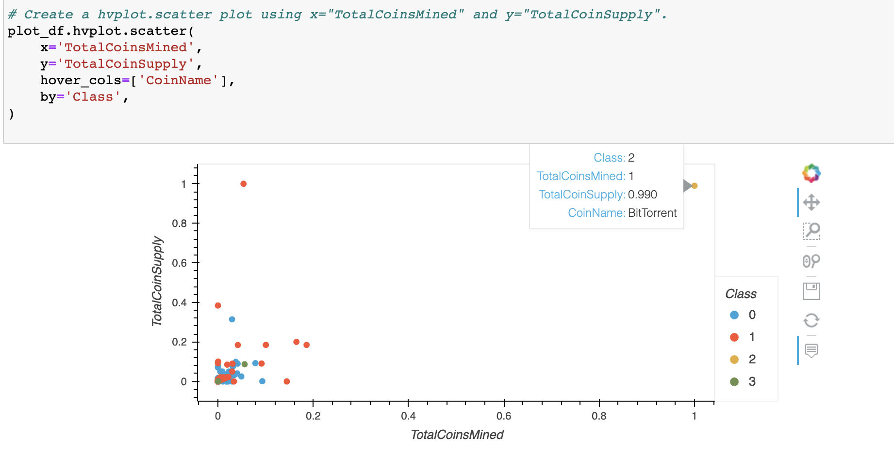

# Cryptocurrencies
Machine Learning – Unsupervised

## Overview

The purpose of this assignment was to reinforce our understanding on what unsupervised learning is used for, how to process the data, how to reduce the dimensions, and how to reduce the principal components using PCA.

To showcase our skills in this subject matter, we created an analysis for a hypothetical client who was preparing to get into the cryptocurrency market. A CSV containing crypto currency data was provided for the analysis. The task involved creating a report that included what cryptocurrencies were on the trading market and how they could be grouped to create a classification system for the new investment.

## Results

The data was processed to fit the machine learning models. Since there was no known output for what we were looking for, it was decided to use Unsupervised Learning. To group the currencies, a clustering algorithm was used. Data visualizations were also created to share the findings with the client.

### Fig.1

- 4 clusters are determined in this Elbow Curve
### Fig.2

- Data classified into 4 groups
- **BitTorrent** is the clear outlier while the other 3 clusters have relatively clear boundaries

### Fig.3 & 4
**TotalCoinsMined vs. TotalCoinSupply**

- This clustering does not provide much insight into the cryptocurrencies' trend...more features should be added to extract meaningful groupings
